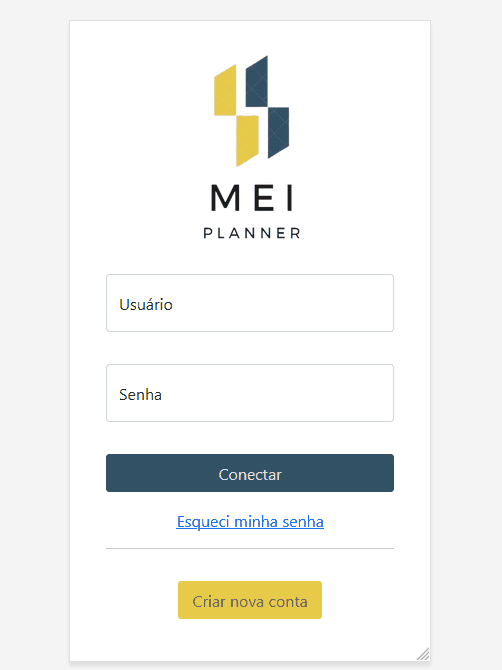
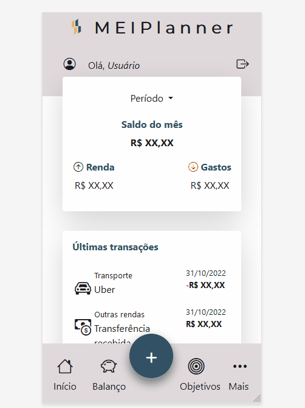
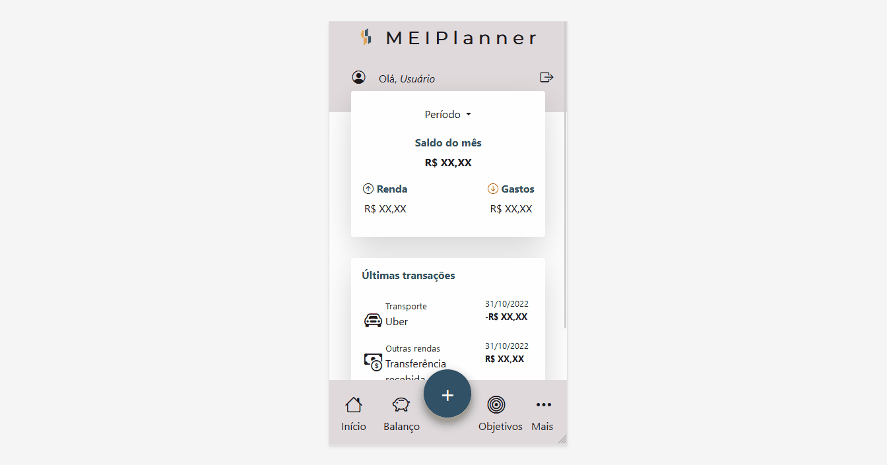

<h1 align="center"><a href="#">Projeto Fintech</a></h1>

Projeto de desenvolvimento de um app de controle financeiro para o curso de Análise e Desenvolvimento de Sistemas da FIAP.

## Deploy
Projeto hospedado no Github Pages:
[MEIPlanner](https://vicbuss.github.io/Projeto-Fintech/)

  <a href="#-tecnologias">Tecnologias</a>&nbsp;&nbsp;&nbsp;|&nbsp;&nbsp;&nbsp;
  <a href="#-projeto">Projeto</a>&nbsp;&nbsp;&nbsp;|&nbsp;&nbsp;&nbsp;
  <a href="#memo-licença">Licença</a>

	

  

<h3 align="center">
  Tela de login
</h3>

---

<h3 align="center">
  Tela Dashboard
</h3>

---

<h3 align="center">
  Responsividade
</h3>

## 🛠️ Tecnologias/ Ferramentas

Esse projeto foi desenvolvido com as seguintes tecnologias:

- [Bootstrap](https://getbootstrap.com/)

 

## 📃 Projeto

Um aplicativo de planejamento financeiro voltado ao público MEI. Parte do primeiro ano do curso de Análise e Desenvolvimento de Sistemas da FIAP. 
 
O objetivo do projeto é a aplicação de conceitos de fundamentos de desenvolvimento web adquiridos no curso, incluindo <em>mobile-first</em> e responsividade.
 
O projeto será incrementado gradualmente, com a adição de novas telas e, posteriormente, a integração a um banco de dados relacional. 
 

## ⚙️ Como acessar

A tela de login é um placeholder, basta clicar em conectar para acessar o dashboard.

Nem todas as páginas foram completamente implementadas. Conforme o projeto progredir, mais páginas estarão acessíveis. 

 
 

## 🚀 memo: Licença

Esse projeto está sob a licença MIT.

---

Feito por Victor Bussiki  [ 🌐 LinkedIn.](https://www.linkedin.com/in/victor-bussiki-96929051)
